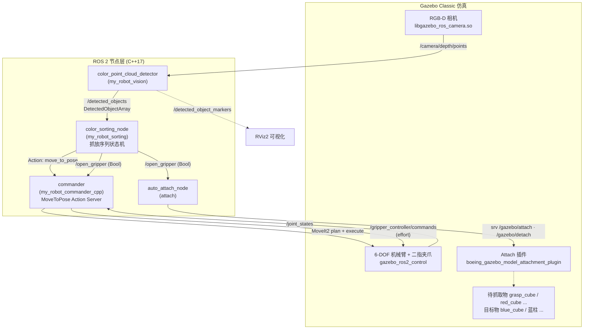

# 🤖 ROS2 + MoveIt2 机械臂视觉抓取分拣系统

> 基于 **ROS 2 Humble + MoveIt2 + Gazebo Classic** 的 6-DOF 机械臂「感知 → 规划 → 抓取 → 分拣」全流程仿真。
> RGB-D 点云检测物体位姿与颜色 → MoveIt2 规划抓取 → 闭合力控夹持 → Gazebo 物理附着搬运 → 按颜色配对堆叠放置。

**技术栈**：`ROS 2 Humble` · `MoveIt2 (MoveGroupInterface / OMPL / KDL)` · `ros2_control + gazebo_ros2_control` · `Gazebo Classic 11` · `TF2` · `ROS 2 Action` · `C++17`

---

## ✨ 核心能力

| 模块 | 能力 | 实现方式 |
|---|---|---|
| 🦾 **运动规划** | 6-DOF 机械臂位姿规划、关节规划、笛卡尔直线路径、自碰撞规避 | MoveIt2 `MoveGroupInterface` + OMPL + KDL IK + SRDF 碰撞矩阵 |
| 👁️ **视觉检测** | 彩色点云 → 物体顶面中心位姿、高度、颜色、类别 | 自研点云栅格连通域聚类 + TF2 变换到基坐标系 |
| 🖐️ **夹持控制** | 位置无关的柔顺夹持，**堵转检测**自动停机（免力传感器的"力控"） | `effort_controllers/JointGroupEffortController` + `/joint_states` 闭环 |
| 🔗 **物理附着** | Gazebo 中模拟真实抓取（物体跟随夹爪、松手释放） | `Attach/Detach` 服务（`gazebo_model_attachment_plugin`）+ 距离匹配自动挂接 |
| 🏭 **自动分拣** | 检测稳定后自动生成「抓取物 → 同色目标位」的完整抓放序列 | 任务配对 + 10 步 Step 状态机 + ROS 2 Action 编排 |
| 🎮 **一键演示** | 仿真 + 规划 + 控制 + 视觉 + 测试物体全栈启动 | 分层 `launch` + 延时编排 |

---

## 📐 系统架构



**数据流（一个完整抓放周期）**

```
点云 30Hz → 栅格聚类/颜色分类 → /detected_objects
   → 分拣节点连续 3 帧检测一致（去抖）
   → 生成 10 步序列：开爪 → 预抓取位 → 直线下探 → 闭爪(堵转即停)
   → 提升 → 预放置位 → 直线下放 → 开爪释放 → 撤离 → 回待机位
   → 每步经 MoveToPose Action 由 MoveIt2 规划执行
   → 闭爪瞬间 auto_attach 调用 Gazebo Attach 建立物理约束，开爪时 Detach
```

---

## 📁 项目结构

```
src/
├── my_robot_description/          # 机器人模型 (XACRO/URDF)
│   ├── urdf/arm.xacro             # 6-DOF 手臂：joint1~joint5(revolute) + joint6(continuous)
│   │                              #   连杆 base/shoulder/arm/elbow/forearm/wrist/hand/tool
│   ├── urdf/gripper.xacro         # 二指夹爪：左右 prismatic 指 + attach_link(附着点)
│   ├── urdf/rgbd_camera.xacro     # RGB-D 相机宏（depth sensor + gazebo_ros_camera 插件）
│   └── urdf/my_robot.ros2_control.xacro   # 硬件接口：手臂 position / 夹爪 effort
│
├── my_robot_moveit_config/        # MoveIt2 配置（MoveIt Setup Assistant 生成 + 调优）
│   └── config/
│       ├── my_robot.srdf          # 规划组 arm/gripper、命名位姿、自碰撞禁用矩阵
│       ├── kinematics.yaml        # KDL 逆运动学求解器
│       ├── joint_limits.yaml      # 速度/加速度限制
│       └── moveit_controllers.yaml# MoveIt ↔ ros2_control 控制器映射
│
├── my_robot_commander_cpp/        # 运动控制节点 (C++)
│   └── src/commander_template.cpp # MoveToPose Action Server + 夹爪力控/堵转检测
│
├── my_robot_vision/               # 视觉检测节点 (C++)
│   └── src/color_point_cloud_detector.cpp  # 点云栅格聚类 + 颜色分类 + 物体测量
│
├── my_robot_sorting/              # 分拣应用 (C++)
│   └── src/color_sorting_node.cpp # 检测去抖 + 抓取/目标配对 + 10 步抓放序列状态机
│
├── attach/                        # Gazebo 物理附着桥接 (C++)
│   ├── src/auto_attach_node.cpp   # 监听 /open_gripper → 自动调用 attach/detach 服务
│   └── config/graspable_models.yaml  # 可抓取模型白名单
│
├── my_robot_interfaces/           # 自定义接口
│   ├── msg/DetectedObject.msg     # id/color/top_center/height/diameter_x/shape
│   ├── msg/DetectedObjectArray.msg
│   ├── msg/PoseCommand.msg
│   └── action/MoveToPose.action   # 目标位姿 goal + success/error_code result + state/progress feedback
│
├── my_robot_bringup/              # 系统集成
│   ├── launch/demo.launch.py      # ⭐ 一键全栈启动
│   ├── launch/robot.launch.py     # Gazebo + move_group + commander + auto_attach + RViz
│   ├── config/ros2_controllers.yaml  # arm: JointTrajectory / gripper: Effort / joint_state_broadcaster
│   └── worlds/attach.world        # 含 Attach 插件的仿真世界
│
└── my_robot_test/                 # 测试资源
    ├── models/                    # red_cube / blue_cube / grasp_cube / blue_cylinder / frustum_obstacle
    ├── launch/spawn_test_models.launch.py
    └── src/point_cloud_box_center.cpp   # 点云工具节点脚手架
```

> **子模块**：`src/gazebo_model_attachment_plugin` → [anwei-dev/gazebo_model_attachment_plugin](https://github.com/anwei-dev/gazebo_model_attachment_plugin)（Gazebo 模型刚体绑定插件，提供 `/gazebo/attach`、`/gazebo/detach` 服务）

---

## 🛠️ 环境要求

| 依赖 | 版本 |
|---|---|
| OS | Ubuntu 22.04 |
| ROS 2 | Humble Hawksbill (LTS) |
| MoveIt2 | 2.x (Humble) |
| Gazebo | Classic 11 |
| 编译器 | GCC ≥ 11 (C++17) |

## 🚀 快速开始

### 1. 克隆（含子模块）与依赖

```bash
git clone --recurse-submodules https://github.com/anwei-dev/ros2-moveit2-arm.git ~/ros2_ws/src/ros2-moveit2-arm
cd ~/ros2_ws

sudo apt install ros-humble-desktop ros-humble-moveit ros-humble-gazebo-ros-pkgs \
                 ros-humble-gazebo-ros2-control ros-humble-ros2-control ros-humble-ros2-controllers
```

### 2. 编译

```bash
colcon build --symlink-install
source install/setup.bash
```

### 3. 配置 Gazebo 插件路径（⚠️ 必须，否则物体无法被"抓起"）

```bash
export GAZEBO_PLUGIN_PATH=$HOME/ros2_ws/install/boeing_gazebo_model_attachment_plugin/lib:$GAZEBO_PLUGIN_PATH
# 注意：请替换为你工作空间的实际 install 路径
```

建议写入 `~/.bashrc` 或 `local_setup` 钩子，避免每次手动 export。

### 4. 一键启动仿真

```bash
ros2 launch my_robot_bringup demo.launch.py
```

启动内容：Gazebo 世界 + 机器人 + ros2_control + move_group + commander + auto_attach + RViz2 + 测试物体（5s 后）+ 视觉检测（8s 后）。

### 5. 启动自动分拣

```bash
# 另开终端
source ~/ros2_ws/install/setup.bash
ros2 launch my_robot_sorting color_sorting.launch.py
```

机械臂将自动完成：**检测稳定 → 选同色抓取/目标对 → 抓取 → 搬运 → 堆放到同色目标上**。

### 6. 单模块调试

```bash
# 只启动仿真（不带 RViz）
ros2 launch my_robot_bringup robot.launch.py

# 单独启动 RViz（MoveIt MotionPlanning 插件）
ros2 launch my_robot_bringup moveit_rviz.launch.py

# 只生成测试物体
ros2 launch my_robot_test spawn_test_models.launch.py

# 只启动视觉检测
ros2 launch my_robot_vision color_point_cloud_detector.launch.py

# 查看检测结果
ros2 topic echo /detected_objects --once

# 手动下发一个笛卡尔直线运动目标（回退/调试用）
ros2 action send_goal /move_to_pose my_robot_interfaces/action/MoveToPose \
  "{x: 0.4, y: 0.0, z: 0.3, roll: 3.14, pitch: 0.0, yaw: 0.0, cartesian_path: true}"
```

> RViz 查看检测标记：Add → `MarkerArray` → Topic 选 `/detected_object_markers`

---

## 📡 通信接口

### Topics

| Topic | 类型 | 方向 | 说明 |
|---|---|---|---|
| `/camera/depth/points` | `sensor_msgs/PointCloud2` | 相机 → 视觉 | RGB-D 彩色点云（含 `rgb` 字段） |
| `/detected_objects` | `my_robot_interfaces/DetectedObjectArray` | 视觉 → 分拣 | 检测物体列表（基坐标系 `base_link`） |
| `/detected_object_markers` | `visualization_msgs/MarkerArray` | 视觉 → RViz | 物体中心球体 + 文字标签 |
| `/open_gripper` | `example_interfaces/Bool` | 分拣 → 夹爪 / 附着 | `true`=张开并 Detach，`false`=闭合并 Attach |
| `/gripper_controller/commands` | `std_msgs/Float64MultiArray` | commander → 硬件 | 夹爪左右指力矩指令 `[left, right]` |
| `/joint_command` | `example_interfaces/Float64MultiArray` | 外部 → commander | 6 轴关节角直接指令（调试） |
| `/joint_states` | `sensor_msgs/JointState` | 硬件 → commander | 关节状态反馈（夹爪闭环依据） |

### Action

**`/move_to_pose`** — `my_robot_interfaces/action/MoveToPose`

| 部分 | 字段 |
|---|---|
| Goal | `x, y, z, roll, pitch, yaw` + `cartesian_path`（true 走 `computeCartesianPath` 直线，false 走 OMPL 自由规划） |
| Result | `success`, `error_code` |
| Feedback | `state`（planning/completed/failed）, `progress` |

### 自定义消息

```
# DetectedObject
string id                  # obj_0, obj_1 ...（按 x,y 排序后编号）
string color               # red / blue / unknown
geometry_msgs/Point top_center   # 物体顶面中心（抓取参考点）
float64 height             # 顶面高度（分类依据）
float64 diameter_x         # 顶面 X 向尺寸
string shape               # "grasp"=待抓物 | "target"=目标位（按高度阈值分类）
```

### Gazebo 服务（插件提供）

| 服务 | 类型 | 说明 |
|---|---|---|
| `/gazebo/attach` | `boeing_gazebo_model_attachment_plugin_msgs/srv/Attach` | 在 `attach_link` 与物体 link 间建立固定约束 |
| `/gazebo/detach` | `boeing_gazebo_model_attachment_plugin_msgs/srv/Detach` | 拆除约束，模拟松爪 |

---

## 🧠 技术要点（面试深挖用）

### 1. 视觉：零第三方依赖的点云栅格聚类

- 直接用 `sensor_msgs::PointCloud2Iterator` 遍历点云，**不引入 PCL**，降低编译与依赖成本
- 流程：ROI 三维包围盒裁剪（去掉桌面/背景）→ 按 `grid_resolution=1cm` 投影到 XY 栅格 → **8 邻域 DFS 连通域聚类**（等价于欧氏聚类的栅格化实现）→ 点数阈值过滤噪点
- 物体参数估计：取 `z_max` 附近 `top_layer_thickness=1.2cm` 的**顶面薄层点**求均值得到 `top_center`（抓取点直接取顶面中心，天然贴合吸取/下探抓取策略），顶面 X 向跨度作尺寸估计
- 颜色分类：解包 PointCloud2 的 packed `rgb` float → RGB 主导通道比值判别（红：`r > 1.25g && r > 1.25b`；蓝：`b > 1.25r && b > 1.1g`）；类别分类按高度阈值 `0.15m` 区分 `grasp`（待抓）/ `target`（目标位）
- 全流程在 `base_link` 下进行：`tf2_ros::TransformListener` + `CreateTimerROS` 把相机系点云变换到机械臂基座系，保证检测坐标可直接下发运动

### 2. 抓取编排：Action 而非 Topic/Service

- 长时间运行的运动指令用 **ROS 2 Action**（`MoveToPose`）封装，天然获得：goal 拒绝/抢占、cancel、**progress feedback**、结构化 result
- 对比 Topic（无反馈无结果）与 Service（同步阻塞、无法取消），Action 是运动任务的标准抽象，也便于后续接 BehaviorTree 编排
- 分拣节点是纯**客户端状态机**：把一次抓放展开成 10 个 `Step`（位姿步/夹爪步混合），串行推进、逐步确认 result 后再下发下一步，失败即中止序列并复位

### 3. 检测去抖：签名一致性判据

点云检测存在抖动，直接开抓容易扑空。分拣节点对每帧检测构造**签名**（`color|shape|x(1cm量化),y(1cm量化)`），要求**连续 3 帧签名完全一致**才生成抓取序列，简单有效抑制了检测噪声与瞬时误检。

### 4. 夹持力控：位置环 + 堵转检测（免力传感器）

夹爪走 `effort` 接口而非 `position` 接口：

- 闭合 = 恒定力矩 `4.0` 下压，100ms 周期读取 `/joint_states`
- **堵转判定**：连续 4 个周期双指位移均 `< 1e-4 rad` → 判定已夹稳 → 停力保持
- 到达闭合目标位 `±0.025` 也算完成；`/joint_states` 超时 0.5s 则安全保压并告警

> 这是**用力矩环近似力控抓取**的工程做法：不依赖力/力矩传感器，也能实现"夹到物体就停、不空夹不停转"，思路可直接迁移到真机的电流环夹爪。

### 5. 仿真抓取：Attach 插件 + 距离匹配自动挂接

Gazebo 中二指夹爪难以靠纯接触力稳定抓牢小物块（易抖飞）。方案是**物理附着**：

- `auto_attach_node` 订阅 `/gazebo/model_states` 与 `/gazebo/link_states`，实时计算 `attach_link` 与各候选物的**水平距离 + 高度差**
- 收到闭爪指令时，在 `xy < 0.12m` 且 `Δz < 0.15m` 的候选物中取最近者，调用插件 `/gazebo/attach` 建立刚体约束；张爪时 `/gazebo/detach` 释放
- 状态机维护 `attached_ / attach_pending_`，异步回调确认，防止重复 attach
- 附着点 `attach_link` 是夹爪中心的虚拟小球连杆，保证约束建立在指尖包络内

### 6. 运动规划：OMPL 自由规划 + 笛卡尔直线混用

- 接近/转移段（`cartesian_path=false`）：`MoveGroupInterface::setPoseTarget` + OMPL 完整规划，**带碰撞检测**，可绕开 `frustum_obstacle` 障碍物
- 抓取/放置段（`cartesian_path=true`）：`computeCartesianPath`（步长 1cm），保证**垂直下探/提升的直线轨迹**，避免抓取途中摆动碰倒物体；`fraction ≥ 0.99` 才执行
- SRDF 中显式维护自碰撞禁用矩阵（相邻连杆 `Adjacent`、永不可碰对 `Never`），IK 用 KDL 插件
- 姿态用 `tf2::Quaternion::setRPY` 统一转换，抓取俯仰固定 `roll=π`（竖直向下），只调 XYZ，简化求解难度

### 7. 控制层：ros2_control 分离手臂与夹爪

| 控制器 | 类型 | 接口 | 用途 |
|---|---|---|---|
| `arm_controller` | `JointTrajectoryController` | position | MoveIt2 轨迹执行（FollowJointTrajectory） |
| `gripper_controller` | `JointGroupEffortController` | effort | 力矩夹持 + 堵转检测 |
| `joint_state_broadcaster` | `JointStateBroadcaster` | — | 全关节状态反馈 |

---

## 🔧 已知限制 & 后续计划

- **规划启动用固定延时编排**（`TimerAction` 5s/8s），应改为 lifecycle 节点或事件驱动的启动状态机，提升鲁棒性（代码中已留 TODO）
- `moveit_controllers.yaml` 中 `gripper_controller` 仍保留 Setup Assistant 生成的 `FollowJointTrajectory` 描述，与实际 effort 控制器不符（夹爪走话题直控所以不影响运行），待清理
- 视觉目前是几何 + 颜色规则，计划接入 **YOLOv8 / PointNet** 做实例分割与 6D 位姿估计
- 抓取是顶面固定姿态，计划加入**抓取位姿采样 + 抓取质量评估**（如 DexNet 风格 GQCNN）
- 接入 `franka_ros2` / 真机驱动做 sim2real，补齐力传感器后的真力控
- 引入 **BehaviorTree.CPP** 编排多物体连续分拣与异常恢复（当前为单序列状态机）
- 增加 `colcon test` 单元测试（点云聚类、颜色判别、任务配对）与 GitHub Actions CI

---

## 📄 License

MIT

## 🙏 致谢

- [MoveIt2](https://moveit.ros.org/) — 运动规划框架
- [ROS 2](https://docs.ros.org/en/humble/) — 机器人操作系统
- [Gazebo](https://gazebosim.org/) — 物理仿真引擎
- [gazebo_model_attachment_plugin](https://github.com/anwei-dev/gazebo_model_attachment_plugin) — Gazebo 模型附着插件
